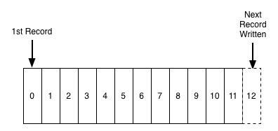
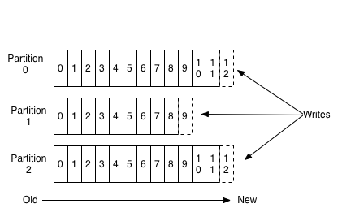
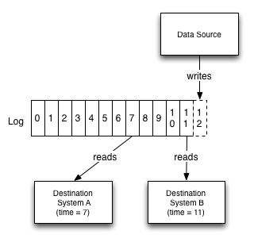
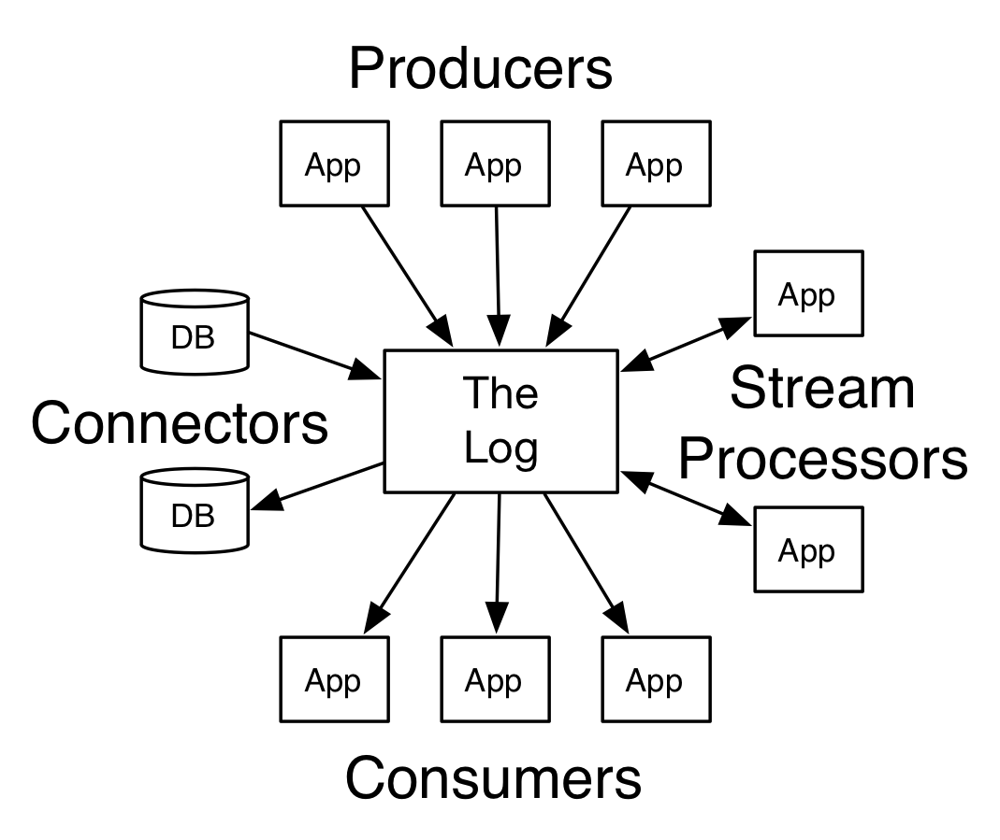
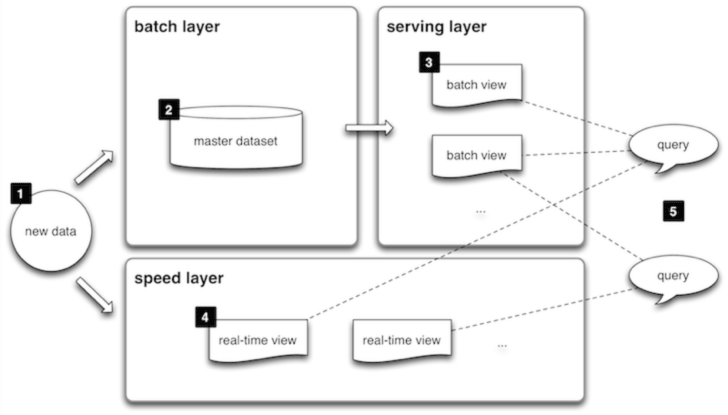
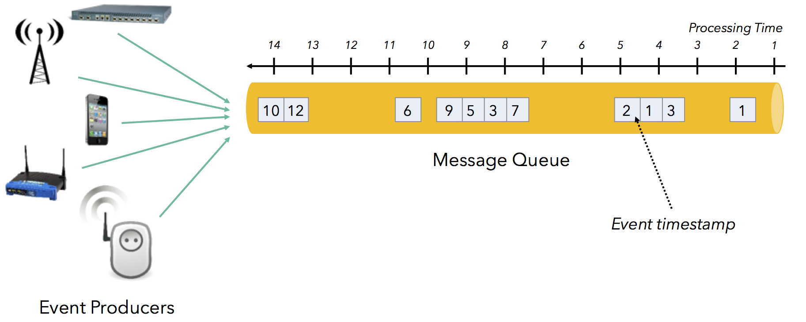
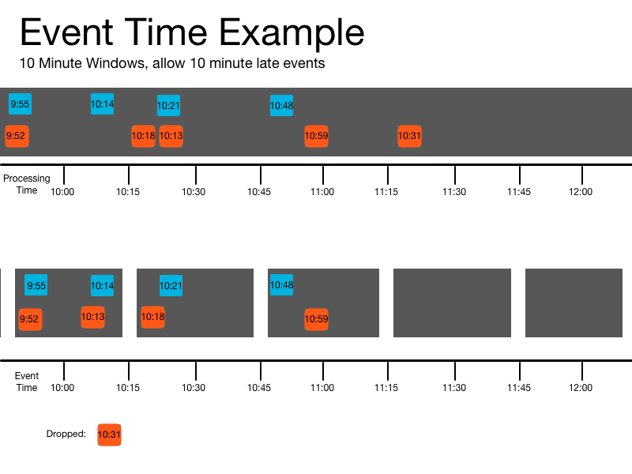
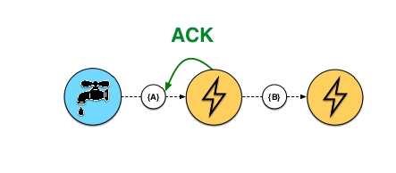

# Simplifying Your Lamba with Kappa
## or: How I Learned to Stop Worrying and Love The Stream

---

# Hi, I'm Addison
## I work at Instructure

----

## On the Data and Analytics Platform team

----

## a.k.a *The Big Data Team*


----

## Some of what we do
- Run a large scale ETL job that processes ~10 TB a day
- Support teams and build tools to make data transformation easier
- Understand and try and design for future needs around data

----

#### (We are hiring btw)

----

# Before We Dig in
- Any questions you have about flink/kappa you want me to answer?
- Feel free to ask questions anytime

----

# Today's Topic
### Why we are moving away from Lambda architectures and towards Kappa and Flink

---

<!-- .slide: data-background="./images/servers.gif" -->

<h1 class="mainTitle">The Difficulties of Data</h2>

----

## OLAP vs OLTP, normalized vs denormalized,
### reads vs writes, relational vs documents,
<small>hierarchical vs flat, row oriented vs column oriented, etc, etc...</small>

----

## Data Modeling: Choose Your Path

<div>
  
  
  
</div>

#### All paths are scary (in very different ways)
Note:
  Data modeling comes down to choosing the best of a lot of scary options, all
  solutions will break down across some dimension

----

## We inevitably will need a different model
#### (And Not with 24 hours latency)

Note:
  Examples:
  user events -> analytics
  application data -> reporting data

----

## We face lots of challenges in changing
- The old model is still needed, which means a continual process
- Migrations with downtime often aren't an option
- Outside of many companies wheelhouse

#### (so we usually never do)

---

<!-- .slide: data-background="./images/stream.gif" -->

<h1 class="mainTitle">How to Stream<h1>
<h2 class="mainTitle">The Log</h1>

----

## Not the println ones
A Log is an append-only data structure ordered by time



----

## We can partition a log



----

## It supports multiple readers while still allowing writes



----

## It can be your core mechanism for data exchange



----

## You should read this article

https://engineering.linkedin.com/distributed-systems/log-what-every-software-engineer-should-know-about-real-time-datas-unifying

also at

https://goo.gl/et6TKf

---

<!-- .slide: data-background="./images/transformers.gif" -->
<h1 class="mainTitle">Transforming Data</h1>

----

## What it needs to do

A few main concerns:
- Scalability
- Low Latency
- Correctness
- Cost

----

## Making trade-offs

It is pretty hard to do all of these

Any data transformation architecture should allow us to tune for our use case and to make trade-offs

---

<!-- .slide: data-background="./images/test-chamber.gif" -->

<h1 class="mainTitle">Lambda Architecture<h1>

----

## Two systems in one

- Batch layer - pure function that computes your view, lots of latency
- Speed layer - purpose-built stream processor to cover gap between batch layer and real-time

----

## A Diagram



----

## Is all that necessary?

Two major reasons for two separate systems:
- It can be insanely hard to get accurate results in real-time
  - At-least-once semantics forces all state to be idempotent for accurate answers
  - Some aggregations require all state to compute
  - Some events may arrive out of order
- You will probably screw up and need to fix a bug which changes all data

----

## Lambda Architecture knobs (or lack thereof)

- We can get low latency, but likely inaccurate until batch layer reprocesses data (correctness vs cost and latency)
- Batch computation can be expensive if we have to recompute the world, incremental batch adds even more complexity (cost vs scalability)
- Not very scalable to have to build 2 systems

---

<h1 class="mainTitle">A new challenger</h1>

<h2 class="mainTitle">Making real-time easier</h2>

<!-- .slide: data-background="./images/supersmash.gif" -->

----

## The major problems of real-time
It's a distributed system...
1. events may arrive out of order, late, or not at all
2. machines fail (and in stream-processing often maintain state)
3. due to 1 and 2, most streaming systems have "at-least-once" message delivery semantics, this makes getting correct answers hard!

---

<h1 class="mainTitle">Enter Apache Flink</h1>

<!-- .slide: data-background="./images/squirrel.gif" -->

----

## What is Flink?

> Apache Flink® is an open-source stream processing framework for __distributed__, __high-performing__, __always-available__, and __accurate__ data streaming applications.

----

## In other words...

You get a framework for building a graph of stateful transformations that can re-distribute and shuffle data and provides an exactly-once model

It turns those into a graph of operations that get distributed across a cluster and handles fault tolerance and restarts for you

----

# A Diagram


----

## Other highlights
Easily wins the contest of best apache animal logo


----

## Flink's solutions to easy real-time processing

----

### Problem: Late-arriving events
### Solution: Time traveling with Event Time

As usual, Google has a solution which is discussed in their MillWheel and DataFlow papers

Allows for us to deal with out of order and late messages

----

## What is time?
- Processing Time
- Ingestion Time
- Event Time

----

## Out of order events



----

## Trust the Event's Time

By using an event's notion of time, we can resolve out of order issues using "windows"

----

## An Example



----

### Problem: Fault Tolerance and Scalability
### Solution: Distributed Checkpoints

----

## Message Guarantees
* __at-most-once__: you get the message either once, or not at all... this is can be useful when you don't care about correctness or consistency
* __at-least-once__: you get the message one or more times, useful if you need to process all messages, but makes some aggregations very difficult
* __exactly-once__: you will receive each message once and only once. This is what we want... but is it possible?

----

## Past Stream Systems
Earlier systems like Apache Storm could offer at-least-once message guarantees through per message ACKing but it came at a high cost of low throughput



----

## Clever Snapshots


----

### Problem: State is hard to reason about with at-least-once
### Solution: Exactly-once processing makes life easier

----

## Accurate results for mortals

Without exactly-once processing, we need to think harder about state

An example: count number of quiz submissions for a given quiz

Note:
We have to keep track of submission ids, basically we need to use a set of ids and count that instead

----

## Some Examples
### Basic Streaming

```Scala
case class WordWithCount(word: String, count: Long)
val windowCounts = text
     .flatMap { w => w.split("\\s") }
     .map { w => WordWithCount(w, 1) }
     .keyBy("word")
     .timeWindow(Time.seconds(5))
     .sum("count")
```

----

## Managed state

Flink's distributed snapshots can include user-defined state

In event of failure, your state rolls back to be consistent with the stream position

Allows for *logically* exactly-once processing

When paired with kafka transactions, you can get exactly-once across multiple jobs

----

### Stateful Example
```Scala
case class WordWithCount(word: String, count: Long)
val windowCounts = text
  .flatMap { w => w.split("\\s") }
  .map { w => WordWithCount(w, 1) }
  .keyBy("word")
  .mapWithState[WordWithCount, Long] {(w, state) =>
    val wordSum = state match {
      case None => WordWithCount(w.word, 1)
      case Some(oldCount) => WordWithCount(w.word, oldCount + 1)
    }
   (wordSum, Some(wordSum.count))
  }
```

----

## What is Flink really?

A stream processor that:
1. is reliable and accurate with low programmer overhead
2. has really great performance
3. is pretty swell

---

<!-- .slide: data-background="./images/kappa.gif" -->

<h1 class="mainTitle">Kappa Architecture<h1>

----

## What is it?

Use a log and a stream processor (like Flink) and write the results somewhere

That's it.

----

## Better than lamba?

For a lot of things, yes!

With sufficiently powerful real-time tools, we get correct streaming results for most transformations

Which means we don't need a batch layer for consistency (woohoo!)

----

## What about mistakes?

One thing lambda architecture solves for is bugs and screw-ups

What about kappa architectures?

----

## Use the log

With a sufficiently long log (like back to the beginning of time), we just rewind the log to the beginning and start over

This also means consistency is easy as we don't need to coordinate between batch and speed layers

----

## A silver bullet?

Not quite...

Some things are still hard to do in real-time and some transformations might require a ton of state

But you should still explore it as it's almost always easier than a lambda architecture

---

<h1 class="mainTitle">The future</h1>

<!-- .slide: data-background="./images/bttf.gif" -->

----

## For us, it is Flink
- Sane model to give programmers
- Much easier to build one system
- Scales to our needs

---


# Thanks!
# Questions?
